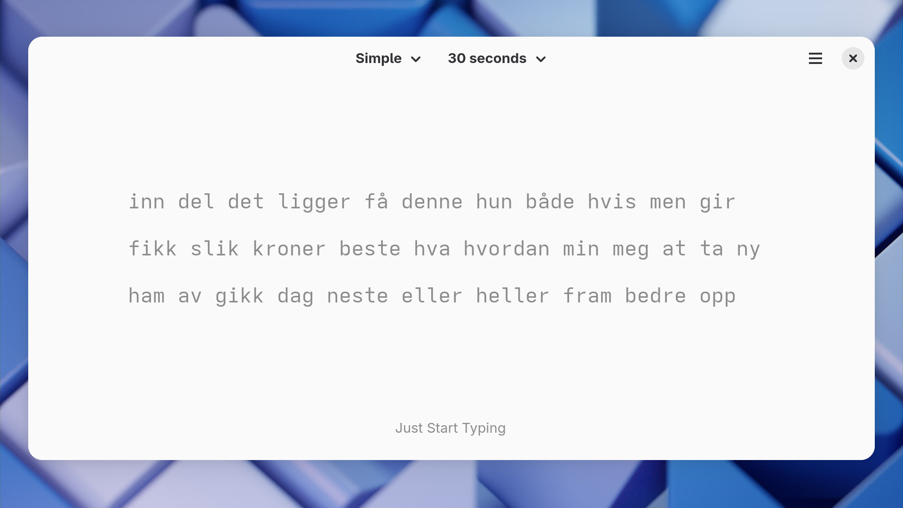
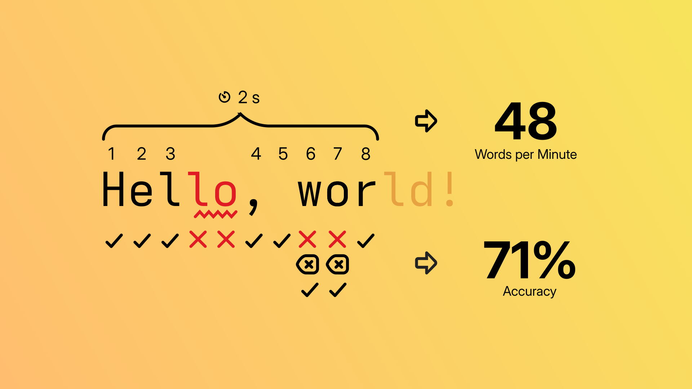
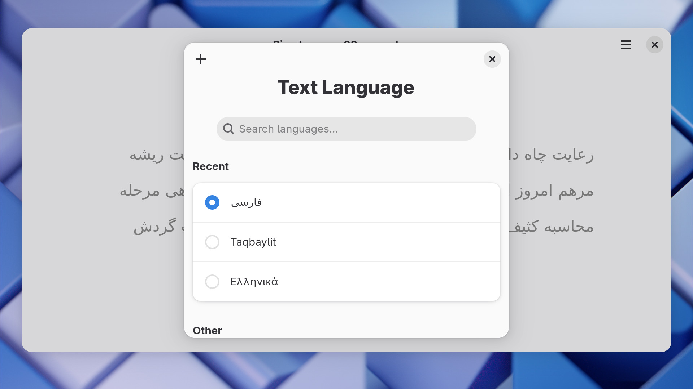
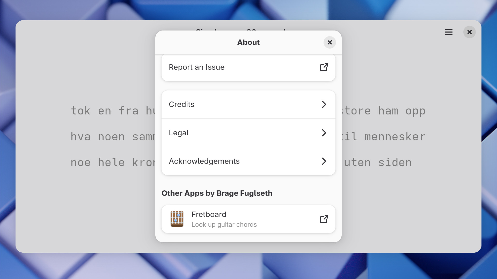

# Keypunch 6.0

Spring is in the air, the snow is finally melting away here in the cold north, and [Keypunch](https://apps.gnome.org/Keypunch) is getting an update! Let's walk through all the new features and improvements together.

## Realistic Results

Up to now, Keypunch's measurements of typing performance have been rather primitive. For speed, it has just compared the total number of typed characters, both correct and incorrect, to the test duration. Likewise, the "correctness" rate is nothing more than the share of correctly typed characters at the time of calculation. If you make a mistake and then correct it, it's not taken into account at all.

These calculations are easy to understand and interpret, but also omissive and potentially misleading. The one for speed in particular has caused some pretty [ridiculous result screens](https://github.com/bragefuglseth/keypunch/issues/85) because of its uncritical counting. Needless to say, this is not ideal.

I've gone a little back and forth with myself on how to move forward, and ended up overhauling both of the calculations: For speed, Keypunch now counts how many *correct* characters there are at the end of the test, while the correctness rate has been replaced with real accuracy, based on *all* operations that have changed the typed text rather than just the final result.

The new calculations come with their own trade-offs, but in general, I believe this is a change for the better.

## Frustration Relief

Learning to type is awfully hard. At least it was for me; sometimes it felt like I wasn't even in control of my own fingers. This made me furious, and my number-one coping mechanism was to go berserk with my keyboard and mash random keys in frustration. As one might guess, this did not help me progress, and I probably should just have gone for a walk or something instead.

To safeguard the poor souls who come after me, I'm introducing something I call *frustration relief*. The concept is simple: If Keypunch detects that you're randomly mashing your keyboard, it will cancel the test and provide a helpful piece of life advice. 

I can't understate how much I wish I had something like this a couple of years ago.

## Input Improvements

Being a text-centric app with multi-language support, Keypunch inevitably has to work with the many intricacies of digital text input. This includes the fact that the Unicode standard contains more than a dozen different space characters. For a while, Keypunch has supported entering regular spaces in the place of [non-breaking](https://en.wikipedia.org/wiki/Non-breaking_space) ones, and now the same is possible the other way around too. Notably, this is a significant improvement for users of the francophone [BÉPO](https://bepo.fr/) keyboard layout.

## New Languages

Keypunch's international community has been hard at work lately, and I'm happy to report a solid upturn in language support. For text generation, these languages have been added:

- Catalan
- Dutch
- Estonian
- Greek
- Indonesian
- Slovak
- Persian

This brings the total language count up to 38! Does Keypunch support your language yet? If not, feel free to open a [language request](https://github.com/bragefuglseth/keypunch/issues/new?template=language_request.yaml).

On the interface translation side, Keypunch has enrolled in GNOME's common translation system, [Damned Lies](https://l10n.gnome.org), allowing it to benefit from the coordinated and high-quality work of GNOME's translation teams. Since the last update, Keypunch has been translated into these languages:

- Catalan
- British English
- Persian
- Finnish
- Indonesian
- Kabyle
- Slovak
- Slovenian
- Chinese

Thanks to everyone who is helping make Keypunch speak their language!

## Platform Progression

This Keypunch release is based on [GNOME 48](https://release.gnome.org/48), which brings a bunch of external platform goodness to the app:

- The latest Adwaita styling
- Better adherence to the system font settings
- Improved performance
- An "Other Apps" section in the About dialog

While not directly part of the runtime, Keypunch will also benefit a lot from the new [Adwaita Fonts](https://blogs.gnome.org/monster/introducing-adwaita-fonts/). It's exciting to build on such a rapidly improving platform.

## Additional Artwork

Apparently, some people are keeping Keypunch [in their game libraries](https://github.com/bragefuglseth/keypunch/issues/97). If you're one of them, I've made a couple of [assets](https://github.com/bragefuglseth/keypunch/tree/main/data/artwork) to make Keypunch integrate better visually with the rest of your collection. Enjoy!

## Circle Inclusion

Keypunch is now part of [GNOME Circle](https://circle.gnome.org)! I'm happy and grateful to have another app of mine accepted into the program. For full transparency, I'm part of the Circle Committee myself, but Keypunch has been independently reviewed by two other committee members, namely [Tobias](https://tobiasbernard.com) and [Gregor](https://codeberg.org/gregorni). Thanks!

## Final Thoughts

That's it for this update. Initially, I was planning on just doing a platform/translation bump now and holding off the headline features for an even bigger update later on, but I decided that it's better to ship what I have at the moment and let the rest wait for later. There's still more on the roadmap, but I don't want to spoil anything!

If you have questions or feedback, feel free to [mention me](https://fosstodon.org/@bragefuglseth) on Mastodon or [message me](https://matrix.to/#/@bragefuglseth:gnome.org) on Matrix.